### 
Projeto Integrador

### 
Desenvolvimento de Sistemas Orientado a Objetos

---

Este repositório foi criado como parte dos estudos da matéria Projeto Integrador: Desenvolvimento de Sistemas Orientado a Objetos

---

### 1ª Entrega

Para a primeira entrega foi proposto o processo de modelagem de projeto voltado a gestão de dados de um centro universitário utilizando os conhecimentos sobre UML. O protótipo deve representar o cadastro de diferentes tipos de pessoas em um sistema de uma grande universidade. Tendo isto em vista foi solicitado que o grupo desenvolvesse:

- Um diagrama de casos de uso que represente os cenários referente a um sistema de gestão escolar contendo as seguintes partes:

  - Pessoa Física
  - Pessoa Jurídica
  - Professores
  - Fornecedores 
  - Alunos
 

- Elaborar a descrição de cenários dos casos de uso construídos, levando em consideração um cenário principal, dois cenários alternativos, pré-condição e pós-condição;
 

- Elaborar um diagrama de classe que esteja de acordo com a proposta do projeto;
 

##### Diagrama de Caso de Uso:
 

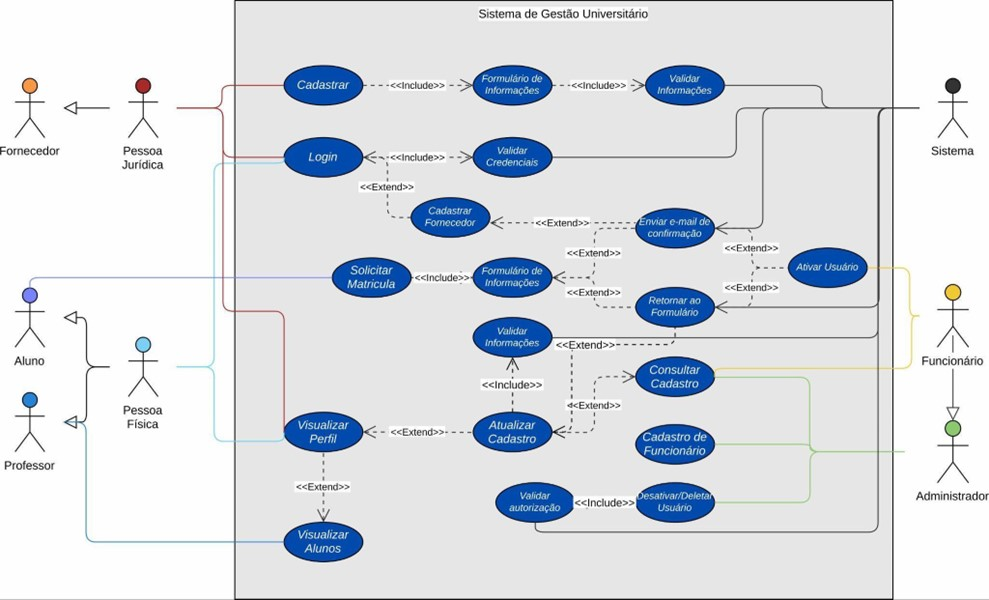

 

##### Diagrama de Classes:

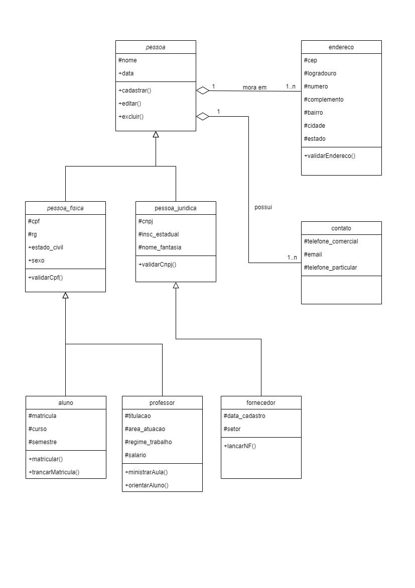

---

### 2ª Entrega

Para a segunda entrega foi proposto o processo de prototipação do que foi formalizado na primeira entrega. A proposta é que o protótipo deve refletir a modelagem realizada anteriormente, portanto o grupo deve desenvolver um projeto funcional com ferramentas como Miro ou Figma. O protótipo deve conter as seguintes jornadas:

  - Cadastro de Pessoa Física
  - Cadastro de Pessoa Jurídica
  - Cadastro de Professores
  - Cadastro de Fornecedores 
  - Cadastro de Alunos

Como entrega opcional foi proposto o desenvolvimento das interfaces prototipadas, utilizando HTML, CSS e conectando com o backend desenvolvido em Java, em que o backend  deverá conter as classes que foram modeladas na fase 1 do projeto.
 

##### Tela de Login

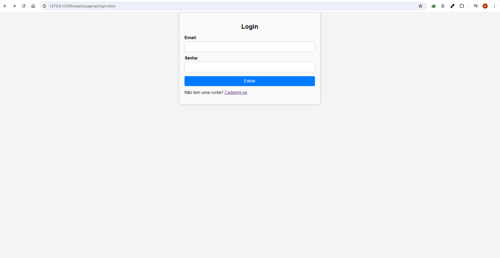
 

##### Painel de Usuário 
Tela para o usuário que se logou na plataforma.
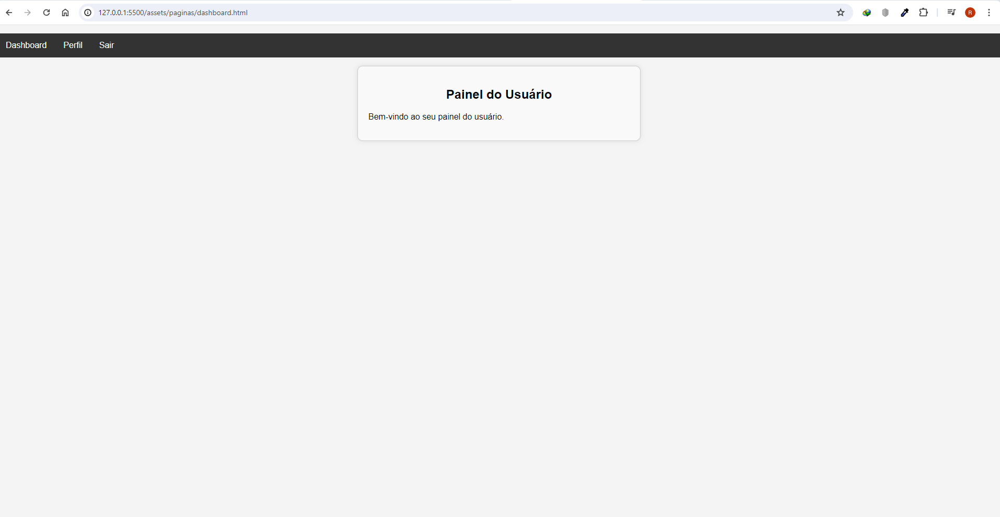
 

##### Perfil de Usuário 
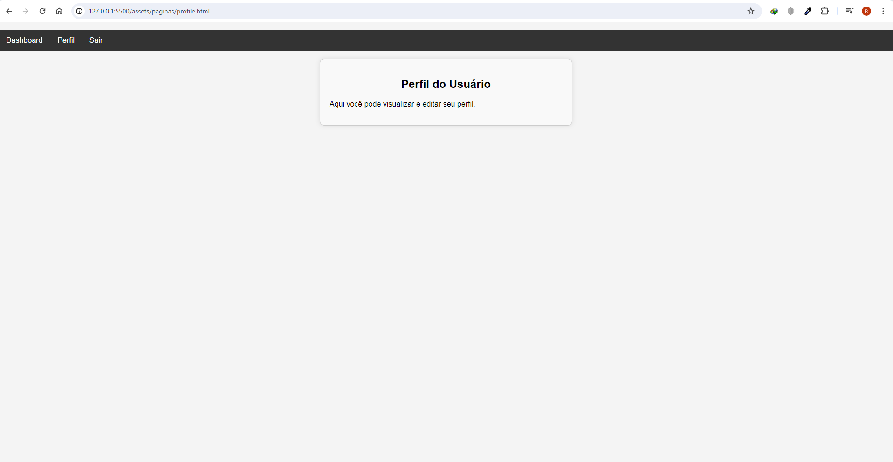
 

##### Tela de Logout
Tela para o usuário que se deslogou na plataforma.
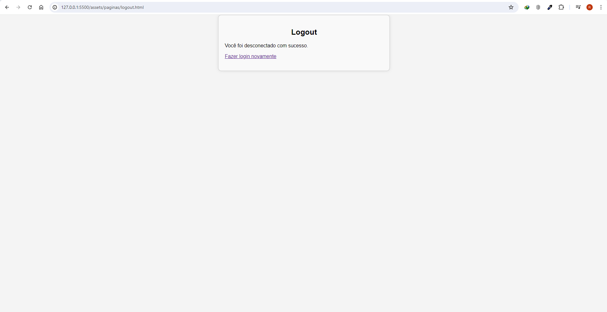
 

##### Tela de Cadastro
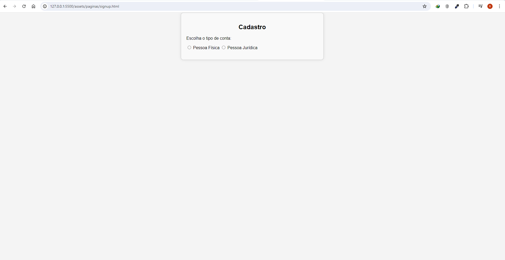
 

##### Cadastro de Pessoa Física
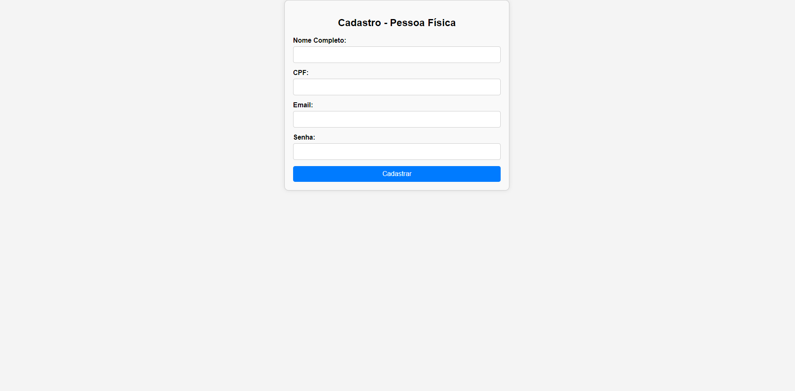
 

##### Cadastro de Pessoa Jurídica

 

##### Cadastro de Professor
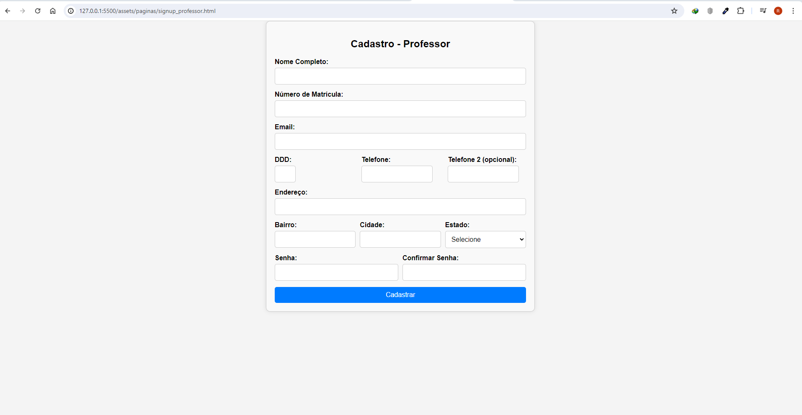
 

##### Cadastro de Aluno
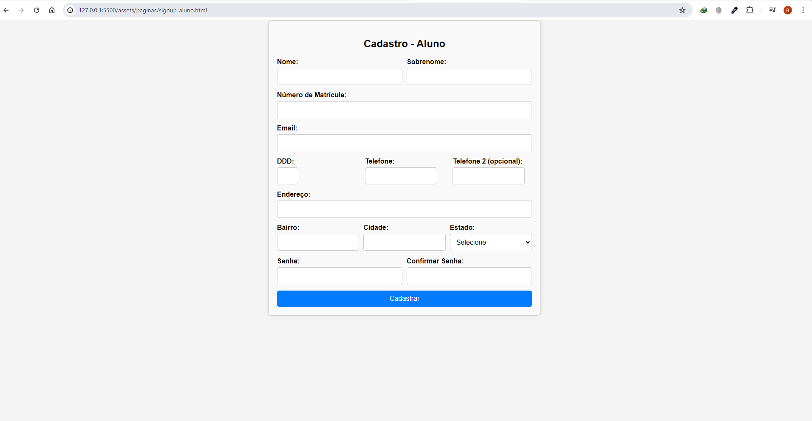
 

##### Cadastro de Fornecedor
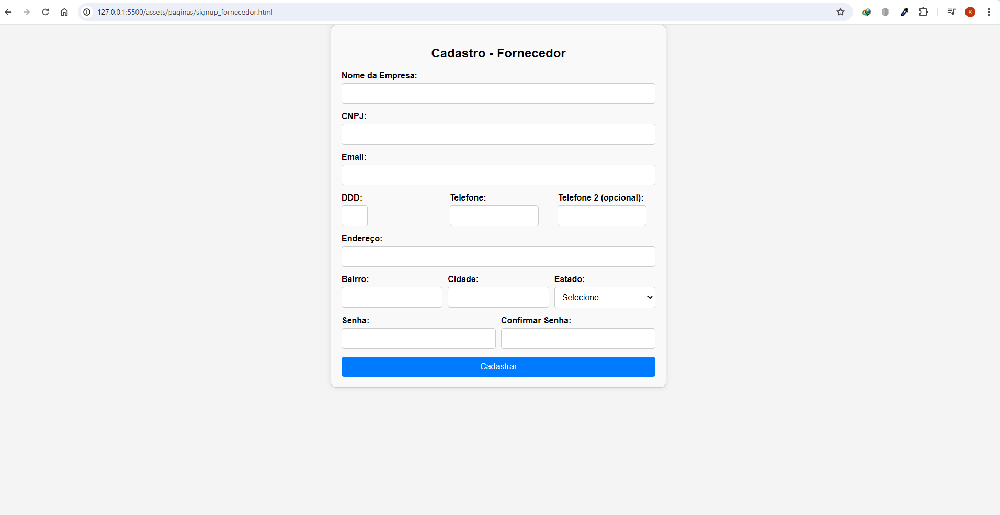
 

##### 
Demonstração do Fluxo de Login/Cadastro

 

<video width="100%" controls>
  <source src="fluxo.mp4" type="video/mp4">
</video>

---

<!-- SVG por DenverCoder1 - https://github.com/DenverCoder1/readme-typing-svg -->

  

Integrantes | Github 
:---------- | :-----: 
:woman_technologist: Ioly Mayara Mesquita Oliveira | <a>https://github.com/iolymmoliveira/iolymmoliveira</a> 
:man_technologist: Jordan Felipe de Souza | <a>https://github.com/JordanFlp</a> 
:man_technologist: Paulo Victor Mariani Cruz | <a>https://github.com/cruzpdev</a> 
:man_technologist: Renato Tavares de Melo | <a>https://github.com/renatoeTavares</a> 

---

##### 
SENAC - Serviço Nacional de Aprendizagem Comercial

##### 
EAD - Ensino à Distância - 2024

 

  

